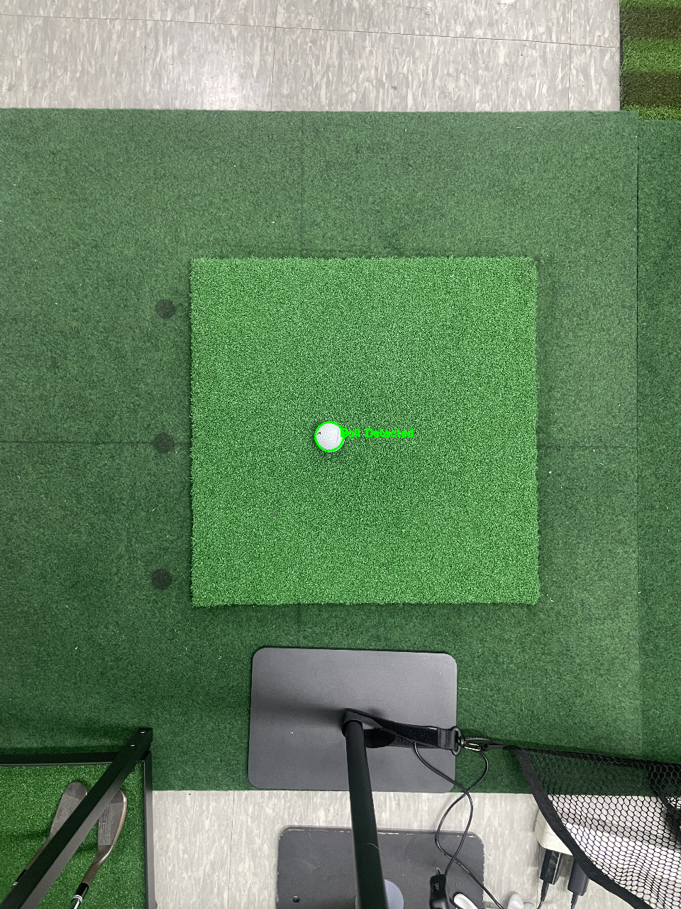

# Golfvision-Tracker

**Golfvision-Tracker**는 가정용 골프 시뮬레이터에서 골프 샷의 속도와 방향을 측정하는 프로젝트입니다. 라즈베리 파이, 스테레오 카메라, 적외선(IR) 센서를 활용하여 골프 연습 환경에서 정확한 데이터를 제공합니다.

## 목차
- [프로젝트 개요](#프로젝트-개요)
- [주요 기능](#주요-기능)
- [기술 스택](#기술-스택)
- [설치 방법](#설치-방법)
- [사용 방법](#사용-방법)
- [기여 방법](#기여-방법)
- [라이선스](#라이선스)

## 프로젝트 개요
Golfvision-Tracker는 골프 샷의 궤적, 속도, 방향을 분석하여 사용자가 가정에서 골프 연습을 할 때 실시간 피드백을 받을 수 있도록 설계되었습니다. 이 프로젝트는 라즈베리 파이와 2개의 카메라, IR 센서를 활용하여 저비용으로 고정밀 데이터 수집을 목표로 합니다.


## 주요 기능
- **샷 속도 측정**: 골프공의 속도를 실시간으로 계산.
- **방향 분석**: 스테레오 카메라를 통해 공의 이동 방향을 추적.
- **데이터 기록**: 연습 데이터를 저장하여 성과 분석 가능.
- **가정용 시뮬레이터 통합**: 기존 골프 시뮬레이터와 호환 가능(예정).

## 기술 스택
- **하드웨어**:
  - Raspberry Pi 5
  - Camera : 하단 카메라 : ov5647 / 상단 카메라 : IMX477(120fps)
  - IR 센서 (샷 감지용)
  - | Sensing Distance | Approx 50cm  |
    | --- | --- |
    | Transmitter/Receiver LED Angle: | 10° |
    |  Dimensions | 20mm x 10mm x 8mm  |
    | Cable Length | 80~100cm 필요 |
    | Weight (of each half) | 3g |
- **소프트웨어**:
  - Python (카메라 데이터 처리 및 센서 제어)
  - OpenCV (이미지 처리 및 분석)

## 설치 방법
1. **하드웨어 설정**:
   - 라즈베리 파이에 카메라와 IR 센서를 연결합니다.
   - 모든 하드웨어가 올바르게 연결되었는지 확인합니다.
2. **소프트웨어 설치**:
   ```bash
   # 라즈베리 파이 OS 업데이트
   sudo apt update && sudo apt upgrade -y

   # 필수 패키지 설치
   sudo apt install python3 python3-pip
   pip3 install opencv-python
   ```
3. **리포지토리 클론**:
   ```bash
   git clone https://github.com/Buddycaddy/Buddy-Caddy.git
   cd Buddy-Caddy
   ```

## 사용 방법
1. 라즈베리 파이를 부팅하고 프로젝트 디렉토리로 이동합니다.
2. 메인 스크립트를 실행합니다:
   ```bash
   python3 main.py
   ```
3. 골프공을 지정된 위치에 놓고 샷을 수행하면 속도와 방향 데이터가 화면에 출력됩니다.
4. 데이터를 CSV 파일로 저장하려면 `--save` 플래그를 추가하세요:
   ```bash
   python3 main.py --save output.csv
   ```

## 기여 방법
이 프로젝트에 기여하고 싶다면 다음 단계를 따라주세요:
1. 리포지토리를 포크합니다.
2. 새로운 브랜치를 생성합니다: `git checkout -b feature/YourFeature`.
3. 변경 사항을 커밋합니다: `git commit -m 'Add your feature'`.
4. 푸시 후 풀 리퀘스트를 생성합니다: `git push origin feature/YourFeature`.

버그 리포트나 기능 제안은 [Issues](https://github.com/Buddycaddy/Buddy-Caddy/issues) 페이지에서 작성해 주세요.
